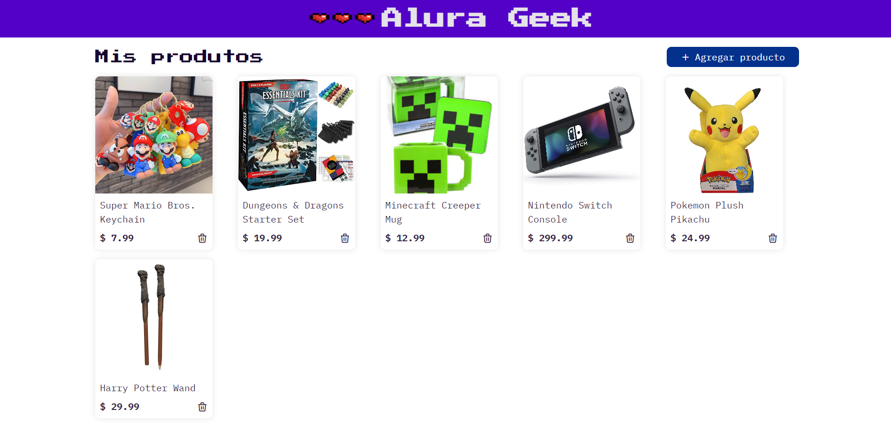

# Alura Geek Challenge - Oracle One Education & Alura Latam

Alura Geek es una aplicación desarrollada como parte del Challenge de Alura Latam y Oracle Next Education. Este proyecto permite aplicar y mejorar habilidades de programación en JavaScript, incluyendo programación asíncrona, solicitudes HTTP, validación de formularios, manipulación del DOM y otros conceptos avanzados.

## Tabla de contenidos

- [Visión general](#visión-general)
  - [Descripción](#descripción)
  - [Capturas de pantalla](#capturas-de-pantalla)
  - [Enlaces](#enlaces)
- [Mi proceso](#mi-proceso)
  - [Construido con](#construido-con)
  - [Lo que aprendí](#lo-que-aprendí)
  - [Desarrollo continuo](#desarrollo-continuo)
  - [Recursos útiles](#recursos-útiles)
- [Autor](#autor)
- [Agradecimientos](#agradecimientos)
- [Instrucciones de instalación](#instrucciones-de-instalación)

## Visión general

### Descripción

Alura Geek es un Gestor de una tienda en línea donde los usuarios pueden agregar, ver y eliminar productos. La aplicación está diseñada para aplicar conceptos de desarrollo web modernos y seguir un modelo de diseño proporcionado en Figma. 

En esta aplicación, los usuarios pueden:
- Agregar nuevos productos con nombre, precio y url de la imagen.
- Ver una lista de productos Geek.
- Eliminar productos de la lista.

### Capturas de pantalla




### Enlaces

- URL del sitio en vivo: [Alura Geek](https://carlos-espipliego.github.io/one-challenge-alurageek/)
> **Nota**: Debido a que se utilizó `json-server` para simular una API, no es posible visualizar el sitio funcionando con la API en GitHub Pages. Sin embargo, puedes descargar el proyecto y seguir las instrucciones de instalación para ejecutarlo localmente. 👉 - [Instrucciones de instalación](#instrucciones-de-instalación)

## Mi proceso

### Construido con

- HTML5 semántico
- CSS3 con Flexbox y Grid
- JavaScript ES6+
- JSON-Server para la simulación de una API
- Axios para las solicitudes HTTP
- [Animate.css](https://animate.style/) para animaciones

### Lo que aprendí

Durante este proyecto, aprendí a:
- Implementar y consumir una API falsa usando JSON-Server.
- Manejar solicitudes HTTP asíncronas con Axios.
- Validar formularios y manejar eventos en JavaScript.
- Manipular el DOM para renderizar dinámicamente elementos HTML.
- Utilizar módulos de JavaScript para una mejor organización del código.

### Desarrollo continuo

En el futuro, me gustaría:
- Mejorar la responsividad del diseño.
- Implementar una base de datos real para almacenar los productos.
- Añadir autenticación para usuarios.

### Recursos útiles

- [Axios Documentation](https://axios-http.com/docs/intro) - Esta documentación me ayudó a entender cómo realizar solicitudes HTTP de manera eficiente.
- [JSON-Server](https://github.com/typicode/json-server) - Esta herramienta fue fundamental para simular una API durante el desarrollo.

## Autor

- Sitio web - [Carlos Espinoza](https://galaxypliego.github.io/portfolio-web-one/)
- Frontend Mentor - [@GalaxyPliego](https://www.frontendmentor.io/profile/GalaxyPliego)
- Github - [@GalaxyPliego](https://github.com/GalaxyPliego)

## Agradecimientos

Gracias a Alura Latam y Oracle Next Education por la oportunidad de participar en este desafío. Agradezco también a mis compañetos estudiantes de ONE que siempre está dispuesta a ayudar y compartir su conocimiento.

## Instrucciones de instalación

Para ejecutar este proyecto localmente, sigue estos pasos:

1. **Clona el repositorio**:

    ```bash
    git clone https://github.com/your-username/your-repo.git
    cd your-repo
    ```

2. **Instala las dependencias**:
    Asegúrate de tener Node.js instalado en tu máquina. Luego, instala las dependencias del proyecto:

    ```bash
    npm install
    ```

3. **Inicia el servidor JSON**:
   JSON-Server se utilizará para simular una API. Ejecuta el siguiente comando para iniciar el servidor:

    ```bash
    npx json-server --watch data/db.json
    ```

    El servidor se ejecutará en `http://localhost:3000`.

4. **Abre la aplicación con Live Server**:
    Abre el archivo `index.html` con Live Server.

    ¡Listo! Ahora puedes interactuar con la aplicación y ver los productos Geek. 🚀

